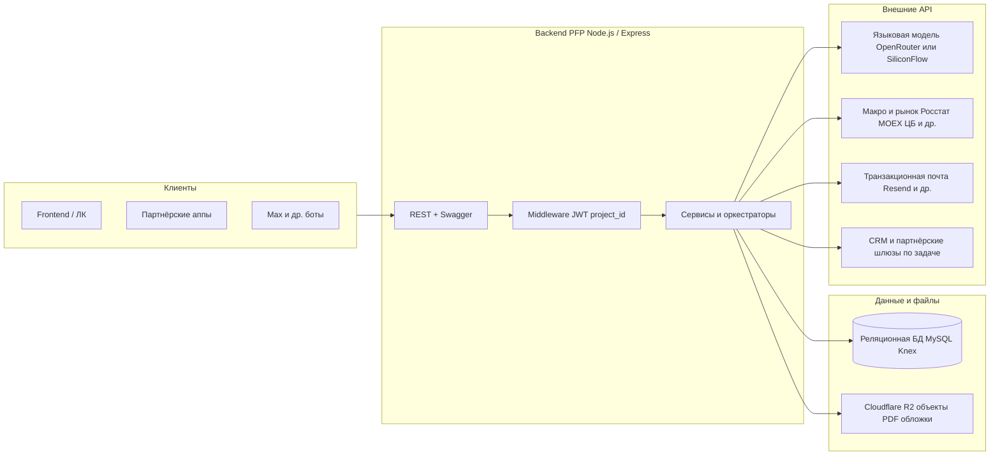
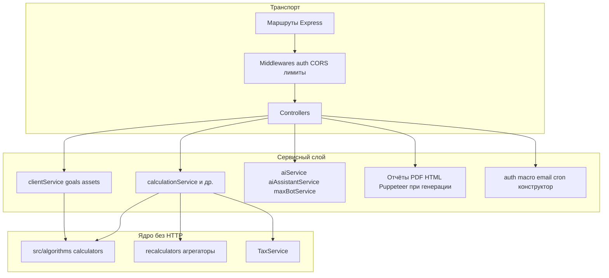
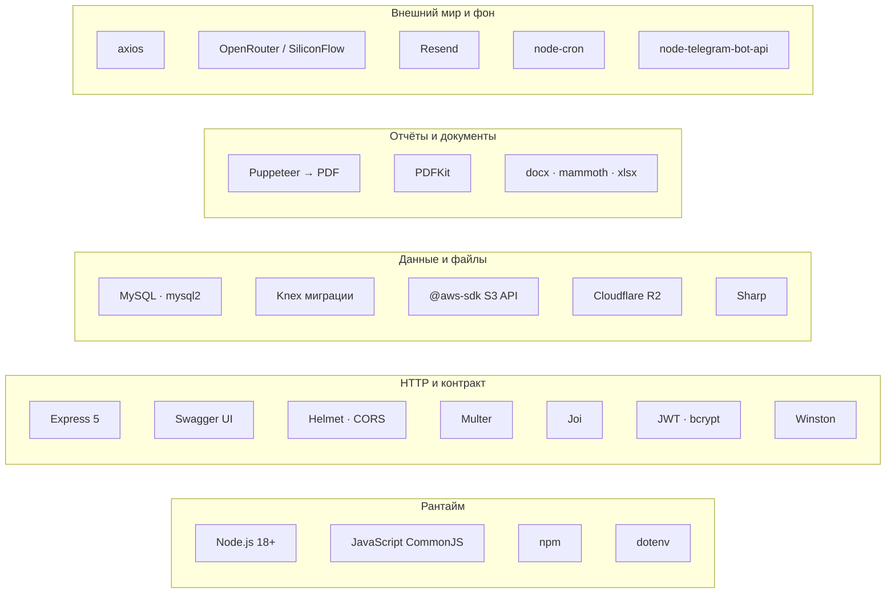

# Архитектура проекта "Max Bot / PFP Backend"

## Общее описание
Платформа представляет собой backend-инфраструктуру для персонального финансового планирования (PFP) и управления ботами-ассистентами. Разработана на базе **Node.js** с использованием легковесных HTTP-фреймворков и предназначена для расчетов инвестиционных, пенсионных, страховых и иных финансовых целей.

## Схемы системы

Ниже — упрощённые представления: кто с кем говорит снаружи и как устроены слои внутри одного процесса backend.

### Контекст: клиенты, backend, БД, LLM и внешний мир

**Как читать.** Пользователь или интеграция бьёт в **HTTP API** backend. Там же проверяется доступ (**JWT**, при необходимости изоляция по **`project_id`**). Дальше идут **сервисы**: они читают и пишут **БД**, кладут тяжёлые файлы в **R2**, по сценарию дергают **провайдера LLM** (чат, конструктор, CRM-подсказки), **макро/рынок**, **почту** и прочие интеграции. Языковая модель **не** сидит внутри репозитория — это отдельный облачный API; backend только формирует запрос и обрабатывает ответ.

### Внутри backend: слои от HTTP до алгоритмов

**Как читать.** **Контроллеры** — тонкий слой: валидация, коды ответов, вызов сервиса. **Сервисы** держат сценарии и работу с БД. **Алгоритмы** — чистая логика расчётов; их вызывают сервисы, подставляя уже подготовленный контекст (так проще тестировать и не смешивать HTTP с математикой). Генерация отчётов может поднимать **Puppeteer** в том же процессе — на схеме это отражено как часть сервисного контура отчётов.

### Стек технологий (блоками)

Схема как на слайде: **пять колонок слева направо**. Внутри колонки — стек сверху вниз; **стрелок между колонками нет** (это не pipeline запроса, а группы зависимостей из `package.json`).

| Колонка | Технологии |
|---------|------------|
| Рантайм | Node.js ≥18, CommonJS, npm, dotenv |
| HTTP и контракт | Express 5, Swagger UI, Helmet, CORS, Multer, Joi, JWT, bcrypt, Winston |
| Данные и файлы | MySQL, `mysql2`, Knex, `@aws-sdk/client-s3`, R2, Sharp |
| Отчёты и документы | Puppeteer, PDFKit, docx / mammoth / xlsx |
| Внешний мир и фон | axios, LLM (OpenRouter/SiliconFlow), Resend, `node-cron`, Telegram API |

## Основные компоненты системы

### 1. Ядро расчетов (Algorithms)
Вся математика вынесена в изолированный слой `src/algorithms/`. Это гарантирует независимость бизнес-логики от транспортного слоя.
- **Модели калькуляторов (`calculators/`)**: `PensionCalculator`, `LifeInsuranceCalculator`, `InvestmentCalculator`, `RentCalculator` и др.
- **Перерасчеты (`recalculators/`)**: Механизмы актуализации целей при изменении вводных параметров.
- **Агрегаторы (`PortfolioAggregator`)**: Сервис сводки доходностей, налогов и консолидированного формирования портфеля.
- **Налоговая машина (`TaxService`)**: Изолированный сервис для расчетов НДФЛ, налоговых вычетов (ПДС, ИИС) и прогрессивной шкалы налогообложения.

### 2. Сервисный слой (Services)
Отвечает за бизнес-сценарии:
- `clientService` — Управление жизненным циклом клиента (создание, обновление профиля, работа с активами).
- `calculationService` — Оркестратор, вызывающий нужные алгоритмы из папки `algorithms` для расчета "First Run" и построения финансового плана.
- `aiService`, `aiAssistantService`, `maxBotService` — Интеграции с LLM и управление ботами.
- `authService` — Авторизация пользователей, JWT-токены, безопасность.

### 3. Интеграции и Контроллеры
- **REST API (`src/controllers/`)**: Маршрутизация запросов от frontend/аппов.
- **База Данных**: Реляционная БД **MySQL** через `knex.js` (в облаке чаще всего Railway MySQL). Схема включает клиентов (`clients`), цели (`goals`), активы, истории расчетов и профили рисков.
- **External API**: Интеграция с Росстатом (`rosstatService`), почтой (`emailService`), CRM и внешними ботами.

## Безопасность (Security)
1. **Авторизация**: Для подавляющего большинства эндпоинтов используется строгая авторизация с проверкой JWT-барьер-токена (Middleware).
2. **Изоляция данных**: Реализована поддержка "Проектов" (`project_id`). Данные разных банков/агентов физически не пересекаются на уровне запросов к БД.
3. **Защита алгоритмов**: Алгоритмы не контактируют напрямую с БД, вся информация подается им через контекст, что позволяет изолированно их покрывать тестами.

## Развертывание
- Платформа готова к контейнеризации. Сборка Docker-образа (`Dockerfile`) происходит за минуты.
- Нативно поддерживается деплой в облачные PaaS-платформы (например, Railway, конфигурация `railway.json`).
