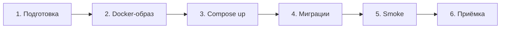
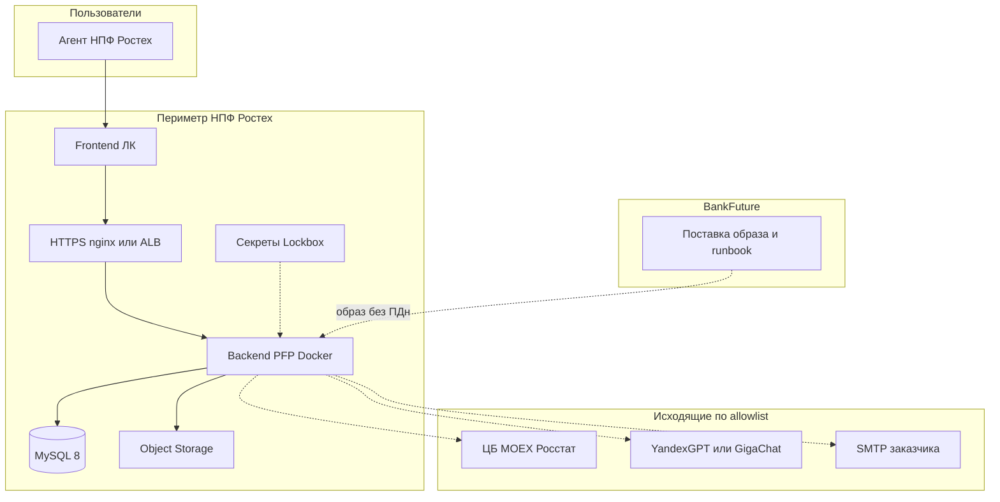
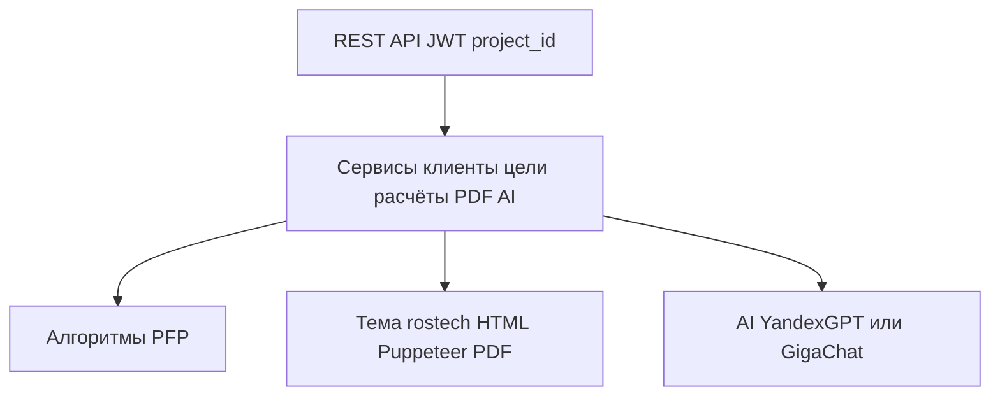
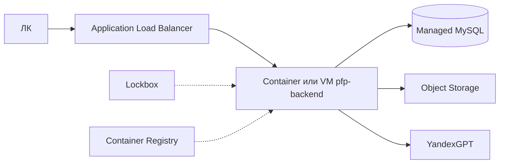
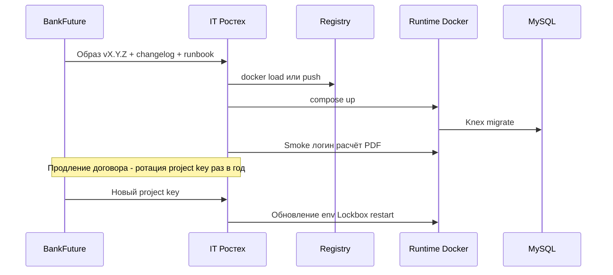

# Система PFP для НПФ Ростех — описание для установки в периметр

Документ для ИТ / ИБ заказчика. Описывает решение **BankFuture PFP** в контуре **НПФ Ростех** (тенант `project_id = 22`, тема PDF `rostech`): стек, установку, требования, контроль, ротацию ключей и архитектуру.

Статус: черновик для согласования контура (on-prem / Яндекс.Облако в периметре заказчика).

---

## 1. Назначение системы

**Персональный финансовый план (PFP)** для агентов и клиентов НПФ Ростех:

- расчёт сценариев по целям (пенсия / ПДС, «сохранить и приумножить», прочие цели — квартира и др.);
- личный кабинет агента (клиенты, цели, портфели, настройки);
- генерация **фирменного PDF-отчёта** в бренде «НПФ Ростех»;
- опционально: AI-ассистент / чат-конструктор (только **YandexGPT** или **GigaChat**), отправка отчёта по e-mail.

Данные клиентов остаются в инфраструктуре Ростеха. Тема отчёта Ростех **не** использует Финам/Comon. Зарубежные LLM (OpenRouter и аналоги) **запрещены**.

---

## 2. Стек технологий

| Слой | Технология |
|------|------------|
| Backend | **Node.js 20**, Express 5, JWT, OpenAPI/Swagger |
| БД | **MySQL 8**, mysql2 + миграции **Knex** |
| PDF | **Puppeteer** + **Chromium** в Docker-образе |
| Хранилище файлов | S3 API → **Yandex Object Storage** (или диск) |
| LLM | **Только YandexGPT или GigaChat** |
| Почта | SMTP заказчика (опционально) |
| Поставка | **Docker** + **Docker Compose** |
| Вход | nginx / ALB + TLS |

Минимальный runtime: **MySQL + backend**. Redis / K8s / GPU не обязательны.

---

## 3. Как происходит установка

### 3.1. Можно ли отдать Docker?

**Да.** Основной способ поставки — контейнерный:

| Артефакт | Содержание |
|----------|------------|
| Docker-образ `pfp-backend:<version>` | Node 20 + приложение + Chromium; при старте `migrate` + `start` |
| `docker-compose.yml` | `mysql` + `backend` (или backend к Managed MySQL) |
| `.env.example` | Список переменных **без** секретов |
| Runbook | Установка, обновление образа, бэкап, ротация ключей |
| (опционально) исходники | Если по договору нужен audit / сборка у заказчика |

Образ передаётся через:

- защищённый registry заказчика / **Yandex Container Registry**, или  
- офлайн: `docker save` → архив по защищённому каналу → `docker load` в периметре.

Исходный код наружу не обязателен, если согласована поставка только образа + compose.

### 3.2. Пошаговый сценарий (типовой)



| Этап | Кто | Действия |
|------|-----|----------|
| **1. Подготовка** | Ростех ИТ | ВМ или проект YC, сеть, TLS, доступы SSH/консоль, политика бэкапов |
| **2. Поставка** | BankFuture | Образ + compose + env-шаблон + runbook (версия зафиксирована) |
| **3. Развёртывание** | Совместно / ИТ Ростех | `docker compose up`; секреты из Lockbox / секретницы; прокси → `:3000` |
| **4. Инициализация** | BankFuture (+ контроль ИТ) | Миграции Knex (авто при старте); тенант Ростех; агенты, портфели, брендинг PDF |
| **5. Проверка** | Совместно | Health, логин, расчёт, PDF в теме `rostech`, (если нужно) вызов YandexGPT/GigaChat |
| **6. Приёмка** | Ростех | Акт / чеклист; доступы BankFuture сужаются до согласованной поддержки |

Повторные релизы — тот же конвейер: новый тег образа → окно обслуживания → `compose pull/up` → миграции → smoke. Полный `seed` на боевую БД **не** выполняется.

### 3.3. Два варианта контура

**A. ВМ + Docker Compose (проще для старта)**  
На одной ВМ: контейнеры `mysql` + `backend`, nginx с TLS, volume БД на диске.

**B. Яндекс.Облако (предпочтительно при требованиях ИБ к managed-сервисам)**  
Managed MySQL + контейнер backend (VM или k8s) + Object Storage + ALB + Lockbox + при необходимости YandexGPT в том же облаке.

---

## 4. Требования к серверу и БД

### 4.1. Сервер приложений (backend)

| Параметр | Минимум | Рекомендация (prod) |
|----------|---------|---------------------|
| CPU | 2 vCPU | **4 vCPU** |
| RAM | 4 GB | **8 GB** (Chromium / PDF; на 4 GB возможны OOM) |
| Диск ОС + логи | 40 GB | **80+ GB** |
| ОС | Linux x86_64 | Ubuntu 22.04 LTS (или образ по стандарту ИБ) |
| ПО | Docker Engine + Compose plugin | актуальный LTS Docker |
| Сеть | Входящий HTTPS (443) | Исходящий HTTPS только по allowlist (§6) |

Порт приложения внутри: **3000** (наружу не публиковать — только через nginx/ALB).

### 4.2. База данных MySQL 8

| Параметр | Требование |
|----------|------------|
| Версия | **MySQL 8.0.x** |
| Размещение | Контейнер на той же ВМ **или** Managed MySQL (YC) |
| Кодировка | `utf8mb4` |
| Сеть | Только из VPC / с backend; **без** публичного IP |
| Доступ | Отдельный пользователь приложения (не root в проде) |
| Диск данных (ориентир старт) | **20–50 GB** SSD; рост — по числу клиентов/отчётов |
| Бэкапы | Ежедневно полный + binlog / PITR по политике ИБ; тест восстановления ≥ 1 раз в квартал |
| Связь с приложением | `MYSQLHOST`, `MYSQLPORT`, `MYSQLUSER`, `MYSQLPASSWORD`, `MYSQLDATABASE` |

Миграции схемы выполняет приложение (Knex) при старте контейнера. Ручные DDL вне миграций — нежелательны.

### 4.3. Ориентир по нагрузке

Для пилота / агентской сети средней численности достаточно одной ВМ 4 vCPU / 8 GB + MySQL. Горизонтальное масштабирование backend — на этапе роста (несколько реплик за ALB; БД одна, primary).

---

## 5. Контроль: кто чем владеет

### 5.1. Разделение ответственности

| Область | НПФ Ростех | BankFuture |
|---------|------------|------------|
| Инфраструктура (ВМ, сеть, TLS, бэкапы) | **Владелец** | Консультация / совместный setup |
| Секреты и ключи в Lockbox / секретнице | **Владелец** | Не хранит прод-секреты у себя после передачи |
| Данные клиентов в MySQL | **Владелец** | Доступ только по письменному допуску на окно поддержки |
| Docker-образ и прикладной код | Поставка по договору | **Разработка и версии** |
| Релизы в периметр | Согласование окна | Готовит образ + changelog + инструкцию |
| Мониторинг / алерты | По стандарту ИБ | Рекомендации по health/логам |
| Договор и лицензионные ключи продукта | Заказчик | Поставщик; продление → ротация (§7) |

### 5.2. Модель контроля доступа

1. **Периметр закрыт:** данные не уходят на инфраструктуру BankFuture.
2. **Админ-доступ** BankFuture к проде — по заявке, срочный/временный (jump-host / VPN), с журналированием.
3. **Релизы:** только подписанный/согласованный тег образа; без «тихого» `latest` в проде.
4. **Аудит:** логи приложения (Winston) + логи прокси; при YC — Cloud Logging.
5. **Тенант:** изоляция `project_id` Ростех; чужие white-label контуры в этот стенд не ставятся.

### 5.3. Контроль обновлений ПО

```text
BankFuture собирает образ vX.Y.Z
        ↓
Передача в registry / офлайн-архив заказчика
        ↓
ИТ Ростех (или совместное окно): pull → staging smoke → prod
        ↓
Откат: предыдущий тег образа (БД — только forward-compatible миграции)
```

---

## 6. Ключи, лицензии и ротация (в т.ч. раз в год)

**Да — ключи можно (и рекомендуется) обновлять по графику**, в том числе **раз в год при продлении договора**.

### 6.1. Какие ключи бывают

| Тип | Назначение | Где хранится | Ротация |
|-----|------------|--------------|---------|
| **Лицензионный / project key** (`X-Project-Key`, публичный ключ проекта) | Привязка фронта/интеграций к тенанту Ростех | БД + конфиг фронта | При продлении договора / компрометации |
| **JWT_SECRET** | Подпись токенов агентов | Lockbox / `.env` | Планово **ежегодно** или при инциденте (потребует re-login) |
| **Пароль MySQL** | Доступ backend → БД | Lockbox | Ежегодно / по политике ИБ |
| **Ключи Object Storage** | PDF / ассеты | Lockbox | Ежегодно |
| **API-ключ YandexGPT / GigaChat** | AI-функции | Lockbox | По политике провайдера + ежегодно |
| **MACRO_CRON_SECRET** и служебные | Защита cron-endpoint’ов | Lockbox | Ежегодно |

### 6.2. Сценарий «продлили договор → обновили ключи»

1. Стороны фиксируют продление и дату окна ротации (например, в течение 5 рабочих дней после даты договора).
2. BankFuture выпускает **новый project key** (и при необходимости инструкции по смене JWT/прочих секретов).
3. ИТ Ростех кладёт новые значения в Lockbox / env, обновляет фронт (`X-Project-Key` / base URL при смене).
4. Старый project key отключается после smoke (перекрытие «старый+новый» на короткое окно — по согласованию).
5. Акт: перечень ротированных секретов (без самих значений) + время применения.

Плановая ротация **не требует** переустановки Docker с нуля — достаточно обновления секретов и перезапуска контейнера backend.

### 6.3. Если договор не продлён

По условиям договора: отзыв лицензионного/project key, остановка права на обновления образа; данные в MySQL заказчика **остаются у Ростеха** (экспорт/архив — по процедуре ИБ).

---

## 7. Внешние сервисы (allowlist)

### 7.1. Внутри периметра (обязательно)

| Сервис | Назначение |
|--------|------------|
| MySQL 8 | Данные |
| Chromium в образе | PDF |

### 7.2. По решению ИБ

| Сервис | В периметре Ростех |
|--------|-------------------|
| Yandex Object Storage | Файлы PDF / обложки |
| ЦБ / MOEX / Росстат | Макро в отчёте (или офлайн-загрузка) |
| SMTP Ростеха | Письма с PDF |
| **YandexGPT или GigaChat** | Единственные допустимые LLM |

### 7.3. Запрещено / не для Ростех

OpenRouter, SiliconFlow, OpenAI и др. зарубежные LLM; Comon/Finam API; необязательные боты Max/Telegram — вне базового контура.

---

## 8. Архитектура

### 8.1. Контекстная схема (C4-стиль)



### 8.2. Внутри backend (слои)



### 8.3. Вариант на Яндекс.Облаке



### 8.4. Поток установки и контроля версий



---

## 9. Состав поставки

1. Docker-образ backend (версионный тег).  
2. `docker-compose` + `Dockerfile` (для аудита/сборки).  
3. Шаблон env, матрица портов и allowlist.  
4. Ассеты темы Ростех + чеклист проверки PDF.  
5. Runbook: установка, обновление, бэкап, **ротация ключей**, откат.  
6. Этот документ.

Frontend ЛК — отдельно; ходит в тот же API в периметре.

---

## 10. Чеклист внедрения (кратко)

**BankFuture:** образ, env-шаблон, тенант Ростех, брендинг PDF, smoke, runbook ротации ключей.  

**Ростех:** ВМ/YC, MySQL + бэкапы, TLS, ИБ-доступы, решение по LLM (YandexGPT vs GigaChat), приёмка.

---

## 11. Открытые вопросы

1. Контур: **ВМ + Compose** или **YC Managed MySQL + ALB**?  
2. LLM на этапе 1: YandexGPT / GigaChat / AI выключен?  
3. Поставка: только образ или ещё исходники в периметр?  
4. График ротации ключей: привязать к дате договора (раз в год) + внепланово при инциденте?  
5. Нужны ли SSO / интеграция с ЛК фонда в первой очереди?

---

*BankFuture · PFP · контур НПФ Ростех · черновик для ИТ/ИБ*
