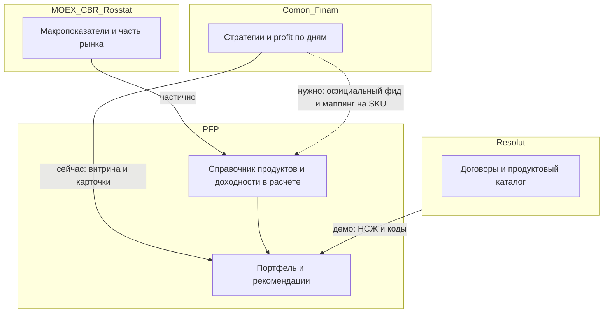

# Данные Финам (Comon) по инвестиционным продуктам — контекст и запрос партнёру

Документ для внутреннего использования и для письма/встречи с Финамом (Comon). Согласован с текущей реализацией в репозитории: см. `[.cursor/agents/comon_finam.md](../../.cursor/agents/comon_finam.md)`, `[src/services/comonService.js](../../src/services/comonService.js)`, `[docs/COMON_STRATEGIES_LK.md](../COMON_STRATEGIES_LK.md)`.

API Резолют (отдельный контур): [RESOLUT_API_REQUIREMENTS_PFP.md](./RESOLUT_API_REQUIREMENTS_PFP.md).

---

## Что уже есть у нас

- **Comon:** витрина стратегий, каталог, карточки во ЛК агента/клиента; ряд доходности `GET …/api/v2/strategies/{id}/profit` (точки с датой и `value`); агрегаты на бэке: total return, CAGR за период ряда, доходность за последние 30 календарных дней — см. `[src/utils/comonProfitMetrics.js](../../src/utils/comonProfitMetrics.js)`.
- **Ограничение:** запросы с IP сервера часто получают **403**; нужны прокси, куки или официальный доступ — см. `[docs/COMON_STRATEGIES_LK.md](../COMON_STRATEGIES_LK.md)`.
- **Отдельно:** макроданные MOEX/ЦБ/Росстат в `[macroService](../../src/services/macroService.js)` — не покрывают весь каталог инвестпродуктов банка и не заменяют дневные ряды по каждому SKU.
- **Прямой Finam-котировочный API** в репозитории как отдельный сервис **не заведён** (см. `[.cursor/skills/pfp-external-market-data/SKILL.md](../../.cursor/skills/pfp-external-market-data/SKILL.md)`).

---

## Чего не хватает для продукта ПФП

1. **Сквозной маппинг:** id стратегии Comon / коды Финам ↔ ISIN, тикер, код продукта в каталоге партнёра (в т.ч. Резолют↔ПФП), чтобы «доходность по дням» относилась к тому же предложению, что в портфеле.
2. **Не только стратегии Comon:** депозиты, облигации, фонды, прочие инструменты — нужны **дневные** ряды (NAV/цена/накопленная доходность) и **стандартные средние** (1M, 3M, YTD, 1Y, 3Y и т.д.) с описанной методологией.
3. **Надёжный серверный доступ** без обхода WAF «в лоб» — для демо и продакшена.

---

## API со стороны Финам/Comon (вызывает ПФП)

Ниже — **логические** операции, которые ПФП должен иметь право вызывать **на вашей стороне** с сервера (не из браузера клиента). Конкретные URL, версии и OAuth/API-key — на согласовании.

### 1. Справочник стратегий (пагинация)

| Параметр            | Где   | Описание                                            |
| ------------------- | ----- | --------------------------------------------------- |
| `page`, `page_size` | query | Постраничная выдача                                 |
| `updated_since`     | query | Инкрементальная синхронизация (если поддерживается) |

**Ответ:** массив сущностей стратегии: как минимум `strategy_id`, `name`, `url`, признаки риска/минимальной суммы, **публичные агрегаты доходности** (если дублируете поля из каталога: за 365 дней, среднегодовая и т.д.).

### 2. История доходности стратегии (дневной ряд)

| Параметр      | Где   | Описание                                           |
| ------------- | ----- | -------------------------------------------------- |
| `strategy_id` | path  | Идентификатор стратегии                            |
| `from`, `to`  | query | Диапазон дат (ISO date), опционально лимит глубины |

**Ответ:** упорядоченный ряд точек: `date`, `value`, при наличии `rValue` — с **документированной** семантикой полей; календарь (торговые/календарные дни), правило пропусков.

### 3. Агрегаты по стандартным окнам (желательно)

| Параметр      | Где   | Описание                            |
| ------------- | ----- | ----------------------------------- |
| `strategy_id` | path  |                                     |
| `windows`     | query | Например `30d,90d,1y,ytd,inception` |

**Ответ:** для каждого окна — доходность (и при необходимости волатильность/просадка) с **ссылкой на методологию** (как считаете).

### 4. Маппинг на рынок (если доступно)

Операция или поля в справочнике: связь `strategy_id` (и/или внутренний код продукта Финам) с **ISIN**, **тикером**, **классом актива** — для согласования с портфелем ПФП и каталогом банка.

### 5. Инструменты вне модели «стратегия»

Отдельные endpoint'ы для **NAV фонда**, **котировок облигаций/акций** по ISIN/ticker: дневная история, час обновления, лицензионные ограничения для банковского партнёра.

### 6. Служебное

Health/readiness, лимиты запросов (RPS), коды ошибок, **тестовый base URL** и выдача ключей под стенд ПФП.

---

## Пункты для письма или повестки встречи с Финамом (Comon)

Ниже — готовые тезисы; при отправке подставьте обращение и контекст демо/интеграции с банком.

1. **Официальный API для серверной выгрузки** истории доходности стратегий (эквивалент или преемник публичного `…/api/v2/strategies/{id}/profit`) с **аутентификацией** (ключ/API token) и/или **allowlist IP** наших стендов, чтобы не зависеть от браузерного CORS и блокировок датацентров.
2. **Документация по полям ряда:** смысл `value` и `rValue`, календарь торгов, обработка пропусков дат — для сопоставления с нашими метриками (CAGR, окна 30/90/365 дней) и комплаенс-текстами.
3. **Справочник соответствий** (если доступен): связь **strategy id / внутренний код продукта Финам** с **ISIN, тикером, классом актива** — для стыковки с портфелем ПФП и с каталогом оформления у партнёра.
4. **Готовые агрегаты с вашей стороны** (если есть): доходность за 30/90/365 дней, YTD, среднегодовая — с **явной методологией**; это снизит расхождения с вашими публичными цифрами на Comon.
5. **Канал для инструментов вне модели «стратегия Comon»:** котировки, NAV фондов, облигации — формат API, частота обновления, глубина истории **по дням**, условия лицензирования для банковского демо и продакшена.
6. **Лимиты, SLA и тестовое окружение** для интеграционных запросов с бэкенда (не из браузера клиента).

---

## Связь с Резолют

Резолют на демо закрывает **договорной контур** (в т.ч. НСЖ) и справочник связки продуктов Резолют↔ПФП. **Рыночная доходность** инвестиционных инструментов — отдельный контур: Финам/Comon, MOEX, паспорта продуктов. Для продуктов, которые одновременно в каталоге Резолют и в инвестиционном портфеле, позже нужно согласовать **источник правды по рыночным параметрам** (гибрид: паспорт + внешний фид).

Кратко см. также блок в [RESOLUT_DEMO_ARCHITECTURE_RESPONSE.md](./RESOLUT_DEMO_ARCHITECTURE_RESPONSE.md).

---

## Схема потоков данных

