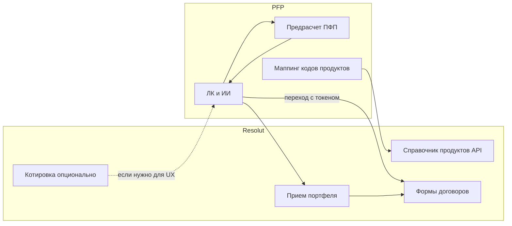

# Черновик ответного письма: архитектура ПФП + Резолют (демо-стенд)

**Перед отправкой:** подставьте обращение, подпись, дату/время созвона (см. плейсхолдеры). Пройдите [внутренний чеклист](#внутреннее-согласование-перед-отправкой).

---

## Тема письма

Согласование архитектуры взаимодействия ПФП и Резолют (демо-стенд), этап 1

---

## Текст письма (можно вставить в почту)

Коллеги, добрый день.

Благодарим за структурированное предложение по архитектуре взаимодействия ПФП-фронта и Резолют в контексте демо-стенда. Ниже — наша позиция по согласованным тезисам, уточнение продуктовых акцентов и перечень вопросов, которые хотелось бы закрыть до детализации контракта API.

**Согласовано / поддерживаем**

1. ПФП-фронт не является «тонким клиентом» Резолют и сохраняет собственную расчётную и рекомендательную логику для формирования предложения клиенту; Резолют решает задачи фронт/бэк-офиса и оформления — с этим согласны.

2. Не смешивать справочники систем «как есть»; для однозначной идентификации продуктов, предлагаемых клиенту, достаточно логической связки кодов (код Резолют — код ПФП) с наименованием и признаком актуальности — такой подход поддерживаем.

3. Для интеграционного контура демо считаем источником актуальности перечня продуктов Резолют; ПФП будет оперировать в рекомендациях подмножеством продуктов, отмеченных у вас как доступные/актуальные (через выдачу API справочника и/или периодическую синхронизацию — по согласованной схеме).

4. Основную операцию этапа 1 видим как приём из ПФП состава портфеля с базовыми параметрами по позициям и данными лица с последующим в Резолют: созданием лица, формированием пакета договоров-заявлений и общей связью на уровне портфеля (в т.ч. блок SALES по агенту) — **в принципе поддерживаем**, при условии уточнения формата запроса/ответа, ошибок и идемпотентности (см. вопросы ниже).

5. План со стороны Резолют по этапу 1 (точка доступа, выдача ключей, авторизация, логирование, описание API, справочник продуктов, операция обработки портфеля с фокусом на НСЖ) выглядит согласованным; со стороны ПФП мы реализуем **исходящие вызовы** вашего API, маппинг кодов продуктов и сценарий передачи портфеля в рамках ЛК.

**Требования к API (вызывает ПФП на стороне Резолют)**

Мы сформировали черновик контракта: какие операции дергаем мы, какие параметры по продукту (в т.ч. НСЖ) ожидаем в запросе и что нужно в ответе для маппинга, котировки и приёма портфеля. Прошу согласовать пути и имена полей под вашу модель при сохранении семантики.

**Приложение:** [RESOLUT_API_REQUIREMENTS_PFP.md](./RESOLUT_API_REQUIREMENTS_PFP.md)

**Позиция по продукту и зонам ответственности**

Для демо и дальнейшего развития мы закрепляем **клиентский путь и основной консультационный инструмент (ИИ + ПФП)** вокруг ЛК ПФП: пользователь формирует понимание целей и портфельного предложения в нашей среде. Резолют в этой модели — **система исполнения и учёта на этапе оформления**: источник правды по заявлениям, параметрам продуктов в части договорной оболочки и дальнейшему жизненному циклу договоров. Таким образом, формулировка «мастер-система» для нас корректна **в зоне договоров и контракта передачи данных**; в зоне консультирования и предварительных рекомендаций центр сценария остаётся в ПФП. Мы рассчитываем на предоставление вашего API (справочник продуктов, при необходимости — котировка, операция приёма портфеля) и механизма **бесшовного перехода** (SSO / одноразовый токен / deep link — по вашей стандартной практике) в ваш веб-клиент для продолжения оформления.

Отдельно: встраивание UI Резолют в ПФП (виджеты, iframe) на этапе 1 **не обязательно** и может обсуждаться после фиксации базового API и сценария перехода; если у вас есть готовый вариант встраивания — пришлите, пожалуйста, требования (безопасность, CSP, обмен сообщениями).

**Уточняющие вопросы**

1. **Гранулярность сущности «продукт»** в справочнике связки: это класс НСЖ в целом, **конкретная программа** (код программы), или отдельная продуктовая конструкция под канал? От ответа зависит маппинг на наши сущности (типы/линейки продуктов в ПФП vs программы НСЖ в Резолют).

2. **Отдельная операция котировки** без сохранения заявления: для демо нужно ли заранее показывать клиенту/менеджеру **согласованные с Резолют** цифры до передачи портфеля? Если да — просим заложить в этап 1 хотя бы сценарий для НСЖ; если достаточно отображения после перехода в Резолют — можем стартовать только с операции приёма портфеля.

3. **Идемпотентность и ошибки:** как API ведёт себя при повторной отправке того же портфеля; возможен ли частичный успех по пакету (одна позиция создана, другая — нет); есть ли версионирование или ключ идемпотентности.

4. **Бесшовный переход:** предпочтительный протокол (OAuth2, JWT, одноразовый токен в query), какие атрибуты лица уже должны быть в ПФП до вызова, что обязательно дозаполняется в Резолют, время жизни ссылки/сессии.

5. **Демо-окружение:** base URL, выдача тестовых ключей, используется ли реальная НСЖ-логика или упрощённый контур; ориентиры по времени ответа для живого показа.

6. **Минимальный критерий готовности этапа 1:** готовы совместно утвердить **пример JSON** запроса/ответа для операции приёма портфеля (1–2 позиции НСЖ + лицо + идентификатор/метаданные портфеля) как эталон для разработки с обеих сторон.

Предлагаем короткий созвон (**[указать длительность, например 30–45 минут]**) на **\[дата и время / или: предложите слоты\]**, чтобы зафиксировать: гранулярность продукта, необходимость quote API в MVP демо, формат SSO и состав минимального сценария.

С уважением,  
**\[ФИО, должность\]**  
**\[Компания\]**  
**\[Телефон / email\]**

---

## Внутреннее согласование перед отправкой

Перед отправкой письма команде ПФП стоит **явно зафиксировать** (можно коротко в чате или на планёрке):

| # | Тема | Решение (заполнить) |
|---|------|---------------------|
| 1 | **Нужна ли для демо отдельная операция котировки** (цифры до handoff совпадают с Резолют) или достаточно сценария «переход → видим котировку/суммы в Резолют»? | |
| 2 | **Гранулярность продукта** в наших терминах: маппим программу НСЖ, тип продукта в ПФП или оба уровня; кто отвечает за актуальность паспортов/ставок для корреляции расчётов. | |

После заполнения таблицы при необходимости скорректируйте абзац про котировку (п. 2 в блоке вопросов к партнёрам), чтобы он отражал вашу позицию.

---

## Инвестиционные продукты и данные Финам/Comon (приложение к переписке)

**Контекст:** интеграция с Резолют на этапе 1 про **договорной контур** и НСЖ. Для **инвестиционных** позиций (облигации, акции, фонды и т.п.) согласованность цифр доходности в ПФП опирается на **отдельные поставщики рыночных данных** — в т.ч. экосистема **Финам/Comon** (история по дням, средние за стандартные окна) и внутренние паспорта продуктов; это не заменяется одним только справочником Резолют.

**Опционально вставить в письмо к Резолют** (например, после блока «Позиция по продукту»):

> Для продуктов рыночного типа, которые одновременно фигурируют в инвестиционном портфеле ПФП и в вашем каталоге оформления на последующих этапах, просим отдельно согласовать **источник правды по рыночным параметрам доходности** (внешний фид, в т.ч. Финам/Comon, паспорт продукта, гибрид). На этапе 1 это не блокирует описанный сценарий НСЖ и передачи портфеля.

**Детально** (текущее состояние в коде, пробелы, пункты для письма к Финам): [FINAM_INVESTMENT_DATA_REQUEST.md](./FINAM_INVESTMENT_DATA_REQUEST.md).

---

## Краткая схема (для приложения к переписке, по желанию)

