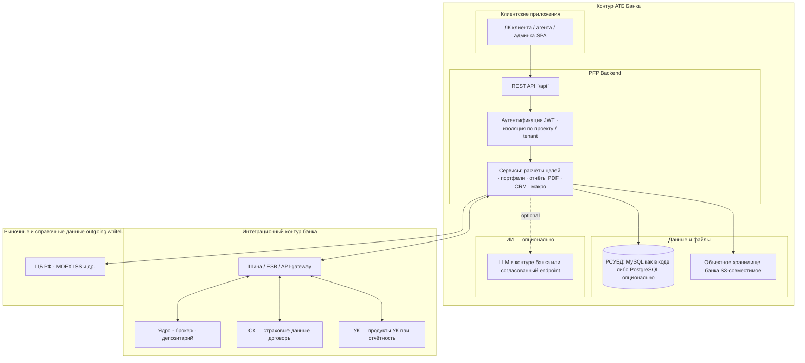

# BankFuture PFP: сводка для ИБ и ИТ АТБ Банка

## 1) Зачем этот документ

Документ фиксирует текущую архитектуру PFP backend, ожидаемое размещение **backend и личных кабинетов (ЛК)** в **контуре АТБ Банка**, а также перечень инфраструктурных/безопасностных требований для запуска в test/prod.

Цель: чтобы команды ИБ и ИТ АТБ Банка заранее понимали масштаб работ, риски и блокеры до этапа go-live.

## 2) Что предлагаем со стороны бизнеса и следующие шаги

Этот блок — для **первого контакта с бизнес-кураторами и ИТ-лидером банка**: что именно мы как BankFuture PFP готовы привезти и как разумно выстроить взаимодействие до «тяжёлого» технического чтения ниже.

### 2.1 Что можем предложить как ценность для АТБ Банка

- **Готовая платформа PFP** в контуре банка: цели, портфели, отчёты PDF, онбординг и анкеты, сегментация масс/премиум через проекты и роли — без необходимости с нуля собирать расчётные ядра и ЛК.
- **Гибкая кастомизация** под линии банка: бренд отчётов, сценарии клиентского пути, набор продуктов и модульность интеграций (ядро, СК, УК) — см. §4.5.
- **Прозрачная дорожная карта ИБ/ИТ**: сначала выравниваем ограничения контура и доступы, затем пилот, затем промышленное развёртывание; ИИ и внешние SaaS явно выносим в опции после вашего решения.
- **Сопровождение внедрения**: совместная проработка контрактов интеграций, участие в НФТ-тестах, методическая поддержка расчётов и отчётности для пользователей банка.

Коммерческие условия (лицензия, сопровождение, объём пилота) обсуждаются **отдельно** и не являются предметом этого технического документа.

### 2.2 Рекомендуемая последовательность шагов (ориентир)

| Этап | Содержание | Зачем банку |
|------|------------|-------------|
| **1. Знакомство и рамки** | Короткий бриф с архитекторами и ИБ: контур, классификация данных, whitelist исходящего доступа | Быстро понять совместимость и красные линии |
| **2. Углублённый разбор** | Детальное прохождение разделов этого документа + при необходимости отдельная сессия по интеграциям СК/УК/ядро | Зафиксировать объём работ и зависимости |
| **3. Дизайн решения** | Целевая схема размещения (§4), выбор MySQL/PostgreSQL, замены R2/Resend, режим ИИ | Единая картина для закупки и календаря |
| **4. Пилот в test** | Ограниченный контур пользователей/агентов, проверка отчётов и интеграций на стендах банка | Снижение риска до промышленного запуска |
| **5. Запуск prod и развитие** | Go-live по согласованному SLA, мониторинг, доработки по обратной связи | Вывод в эксплуатацию и масштабирование |

### 2.3 Что желательно получить от банка на старте (минимум)

- Назначенные **владельцы** со стороны бизнеса и ИТ (единое окно для решений).
- Понимание **приоритетной линии продукта** (например розница vs private первым этапом).
- Готовность выделить **тестовые стенды** смежных систем или контракты на доступ для интеграций.

После этого блока ниже идёт **краткая техническая сводка** и полное описание архитектуры и требований.

## 3) Executive summary (коротко)

- **Размещение:** и **backend**, и **клиентские приложения (ЛК клиента / агента, админка и т.д.)** в целевом сценарии для АТБ Банка рассматриваются как системы **внутри контура банка** (единый периметр доверия; внешний интернет для пользователя — через каналы банка, не «облачный SaaS ЛК» по умолчанию).
- Проект — **Node.js backend**: расчёты финансовых целей, портфели, отчёты PDF/HTML, макроданные, опционально чат и ИИ.
- **ИИ — опция в контуре банка**: может быть развёрнут **внутри периметра** (on-prem / корпоративный inference API) или подключён по отдельному решению ИБ; до включения действует режим **без ИИ** с предсказуемыми fallback в API.
- **Внешние SaaS из текущего прод-контура не являются обязательными для АТБ Банка**: типичные для облачного развёртывания **Cloudflare R2** (объектное хранилище S3-совместимое, обложки PDF и файлы) и **Resend** (транзакционная почта) в контуре банка **не требуются как есть** — предполагается **замена на корпоративное объектное хранилище** и **корпоративную почту / SMTP / внутренний шлюз уведомлений** либо отключение соответствующих функций до совместного проектирования с ИТ/ИБ.
- **БД:** в коде сейчас **MySQL** (`mysql2`, миграции Knex под MySQL). Для контура банка можно **оставить MySQL** как есть с размещением инстанса в контуре АТБ Банка **или опционально** выполнить переход на **PostgreSQL** (подключение `pg`, правки диалекта SQL в миграциях/запросах, регрессия) — решение принимается совместно с ИТ/архитектурой банка, это **не обязательное** требование документа.
- Для prod критичны: отказоустойчивость, аудит, контролируемые внешние доступы, DR; без профиля нагрузки (RPS, конкурентность, SLA) финальный sizing условен.

## 4) Архитектура, API, бизнес-логика и интеграции (целевой контур)

Ниже — логическая картина для согласования с архитекторами и владельцами смежных систем АТБ Банка. Детализация интерфейсов — предмет отдельных спецификаций и НФТ.

### 4.1 Логическая архитектура (high-level)

**Как читать:** **ЛК и backend** показаны внутри **периметра АТБ Банка**; браузер пользователя ходит в ЛК и дальше в **PFP API** (обычно тот же контур или сегмент DMZ по правилам банка). Персистентность — **реляционная БД**: в репозитории сейчас **MySQL**; переход на **PostgreSQL** возможен **опционально** по решению банка. Файлы отчётов — в **объектном хранилище банка**. **ИИ** — только при разрешении ИБ. **СК / УК / ядро** — смежные системы; протоколы согласуются с ИТ АТБ Банка.

### 4.2 Бизнес-логика платформы (уровень продукта)

Кратко, что делает backend с точки зрения бизнеса:

- **Клиент и анкета**: профиль, доходы/расходы, обязательства, горизонты и ограничения.
- **Цели**: пенсия, инвестиции, накопления, иные типы целей из методики PFP — расчёт необходимых сумм, траекторий, сценариев.
- **Риск-профиль** и согласование с инвестиционной линией (где применимо).
- **Портфели**: связка с внешними позициями и классами активов; при наличии интеграций — опора на **актуальные данные** из контура банка / УК / СК.
- **Отчётность**: генерация PDF/HTML отчётов (в т.ч. для партнёрских проектов), настройки обложек и шаблонов.
- **Макроэкономика**: использование обновляемых показателей (ЦБ, MOEX и др.) для расчётов и отчётов — по согласованному whitelist исходящего доступа.
- **ИИ (если включён)**: чат-ассистенты, пояснения текстов — поверх базовой логики, без обязательности для «классических» расчётов.

### 4.3 REST API и документация

- **Базовый префикс:** все основые маршруты приложения монтируются под **`/api`** (например `https://<host>/api/...`).
- **Интерактивная спецификация (Swagger UI):**
  - основной контракт PFP — **`/api-docs`** (OpenAPI `openapi/pfp-api.yaml`);
  - контуры B2C — **`/api-docs-b2c`**;
  - настройки PDF — **`/api-docs-pdf-settings`**.
- **Характерные группы маршрутов** (не исчерпывающий список): аутентификация **`/api/auth`**, клиенты и кабинеты **`/api/client`**, **`/api/pfp/clients`**, **`/api/my`**, продукты и типы **`/api/pfp/products`**, **`/api/pfp/product-types`**, портфели **`/api/pfp/portfolios`**, настройки **`/api/pfp/settings`**, агенты **`/api/pfp/agents`**, отчёты и PDF **`/api/pfp/reports`**, **`/api/pfp/pdf-settings`**, макроданные **`/api/pfp/macro`**, CRM **`/api/pfp/crm`**, интеграция с внешними портфельными системами (пример — Resolut) **`/api/pfp/resolut`**, стратегии Comon/Финам **`/api/pfp/comon`**, конструктор **`/api/pfp/constructor`**, ИИ **`/api/pfp/ai`**, **`/api/pfp/ai-b2c`**, админские и служебные префиксы **`/api/admin/...`**.

Точный перечень методов, ролей и кодов ответов — в OpenAPI; для контура банка дополнительно согласовываются **лимиты**, **IP allowlist**, **mTLS** на шлюзе и политика публикации Swagger (часто только во внутреннем контуре).

### 4.4 Интеграции: СК, УК, банковские системы (портфель, котировки, актуальность)

Цель интеграций — дать клиенту и советнику **согласованную картину**: позиции, оценки, продукты страхования/УК, справочники инструментов — с учётом регламентов банка.

| Направление | Примеры данных | Зачем PFP |
|---|---|---|
| **Банковский контур** | счета, остатки, заблокированные активы, продукты розницы | связка целей с реальными позициями |
| **Брокер / ядро рынка** | котировки, сделки, начисления | актуализация стоимости портфеля |
| **УК** | паи, доли, отчётность фондов | цели и доли в коллективных инвестициях |
| **СК** | договоры, премии, риски по объектам | страховые цели и защита имущества |

Технически это реализуется через **адаптеры** на стороне PFP и **контракты** на стороне банка (шина, API ядра, файловые шлюзы). Требуется от АТБ Банка: **владельцы систем**, **тестовые стенды**, **НФТ** (_latency_, доступность), правила **не выходить за периметр** с ПДн.

### 4.5 Возможности кастомизации BankFuture PFP (продуктовый контур)

Ниже — что можно гибко настраивать под **разные программы, сегменты клиентов и каналы** без форка ядра платформы (детали — в OpenAPI и админских/агентских ЛК).

| Область | Что кастомизируется | Комментарий для банка |
|--------|---------------------|------------------------|
| **PDF-отчёты** | Макеты HTML, **темы оформления**, обложки, цвета и блоки сводной части; загрузка графики бренда агента/программы; превью перед генерацией | API `/api/pfp/pdf-settings`, отдельная спека PDF; под разные партнёрские линии можно держать **разные визуальные профили** |
| **CJM и онбординг клиента** | Первичный расчёт (**first-run**), поэтапное наполнение анкеты, **версии анкеты риск-профиля**, привязка ответов к целям | Сценарий «клиентский путь» задаётся набором экранов ЛК + правилами расчёта; тяжёлые изменения методики — отдельная продуктовая задача |
| **Продукты и цели** | Справочник **типов продуктов** и целей, доступные пользователю сценарии расчёта | Разные программы банка могут показывать разный набор целей и продуктов |
| **Масс-сегмент vs премиум** | Разделение по **проекту (tenant)** и **ролям** (клиент, агент, администратор и др.): разный состав модулей, отчётов, интеграций и правил видимости портфеля | Один backend — несколько **изолированных программ** (например розница vs private); политика доступа и ACL — на стороне конфигурации и ИБ |
| **Портфели и инструменты** | Классы активов, связки с внешними источниками позиций, ограничения по инструментам под сегмент | Согласуется с интеграциями §4.4 |
| **Расширения по программе** | CRM-контуры, **конструктор / сценарии ботов** (если включены по политике), витрины стратегий (например Comon), **налоговое планирование**, отдельные модули (напр. страхование имущества) | Включаются точечно; часть завязана на внешние API и ИИ — только после согласования ИБ |

Итого для презентаций: BankFuture PFP допускает **несколько параллельных «линий»** (масс / премиум / партнёрская программа) за счёт **проекта + ролей + PDF-брендинга + набора продуктов и интеграций**, без обязательного второго контура приложения — если ИТ банка так проектирует изоляцию данных и доступов.

---

## 5) Текущее состояние (as-is)

### 5.1 Runtime и стек

- Node.js: `>=18` по `engines`, в Docker используется `node:20-bookworm-slim`.
- npm: `>=9`.
- Framework: `express`.
- ORM/query builder: `knex`.
- DB driver: `mysql2` (текущий контур).
- PDF (текущий боевой pipeline отчётов/NDA): `puppeteer` + системный `chromium`.
- `pdfkit`: присутствует в проекте для отдельного/legacy-контура, не является обязательным ядром текущей HTML->PDF генерации.
- Макроданные: `axios`, `xml2js`, `xlsx`.
- Безопасность API: `helmet`, `cors`, `jsonwebtoken`, `bcryptjs`.
- Логирование: `winston`.

### 5.2 Системные зависимости контейнера

Сейчас в `Dockerfile` используются:
- `chromium`
- `ca-certificates`
- `fonts-liberation`
- `ghostscript`

Это обязательно для стабильной PDF-генерации и корректной отрисовки шрифтов.

### 5.3 Внешние данные по макроэкономике (актуальный контур)

Используются только:

1. ЦБ РФ:
- ключевая ставка;
- годовая инфляция;
- USD/RUB, EUR/RUB;
- цена золота;
- максимальная ставка по вкладам.

2. MOEX ISS:
- индекс IMOEX;
- доходности ОФЗ G-кривой 2/5/10 лет;
- индекс корп. облигаций RUCBICP.

Ссылки на источники:
- https://www.cbr.ru/DailyInfoWebServ/DailyInfo.asmx
- https://www.cbr.ru/scripts/xml_metall.asp
- https://www.cbr.ru/statistics/avgprocstav/
- https://iss.moex.com/iss/engines/stock/markets/index/securities/IMOEX.json
- https://iss.moex.com/iss/engines/stock/zcyc.json
- https://iss.moex.com/iss/engines/stock/markets/index/securities/RUCBICP.json

## 6) Целевое состояние для АТБ Банка (to-be)

### 6.1 Политика ИИ: базово «без ИИ», включение — опция в контуре

По умолчанию для первичного согласования AI/LLM **выключены**. Одновременно фиксируется, что **ИИ может быть частью решения в контуре АТБ Банка** после отдельного решения ИБ и архитектуры:

- **Предпочтительный для банка сценарий** — размещение модели **внутри периметра** (on-prem GPU-кластер или корпоративный inference-сервис с OpenAI-compatible API), без обязательного исходящего трафика на публичные LLM.
- **Альтернатива** — согласованный внешний провайдер через корпоративный egress/proxy и whitelist (как в разделе про опциональный AI).
- В любом режиме до включения ИИ: **нет** ключей провайдеров в окружении, **fallback** API без падения backend.

### 6.2 База данных: MySQL (как в коде); PostgreSQL — опционально

**Фактическое состояние репозитория:** СУБД **MySQL** (`mysql2`), миграции и запросы под этот диалект.

**Опция для контура АТБ Банка:** если ИТ банка стандартизует **PostgreSQL**, возможен **перенос** — отдельный инженерный поток:

- драйвер `pg`, `knex client=pg`;
- адаптация SQL-диалекта в миграциях и запросах;
- проверка индексов, дат/таймзон, JSON-операций;
- регрессия критичных бизнес-сценариев.

Если банк **готов принять MySQL** в своём контуре (отказоустойчивый кластер, backup, политика ИБ), **переписывание под PostgreSQL не является обязательным** для запуска — это предмет отдельного решения и оценки трудозатрат.

## 7) Минимально необходимые компоненты для деплоя

### 7.1 Обязательные runtime компоненты

- Linux x86_64
- Node.js 20.x LTS
- npm 9+

### 7.2 Обязательные npm пакеты (go-live critical)

- `express`, `dotenv`, `axios`, `joi`, `helmet`, `cors`
- `knex` + драйвер выбранной СУБД: **`mysql2`** если остаёмся на MySQL как в коде; **`pg`** если выполняется миграция на PostgreSQL
- `jsonwebtoken`, `bcryptjs`
- `winston`, `swagger-ui-express`
- `puppeteer` (обязательно для текущего HTML->PDF pipeline)
- `pdfkit` (опционально; не критичен для текущего report/NDA pipeline)

### 7.3 Обязательные системные пакеты ОС

- `chromium`
- `ca-certificates`
- `fonts-liberation`
- `ghostscript`

### 7.4 Опциональные компоненты (по включенным фичам)

В DEV/SaaS-контуре часто используются:

- `resend` — транзакционная почта через провайдера Resend.

В контуре **АТБ Банка Resend не обязателен**: почта переводится на **корпоративный SMTP/API** или внутренний шлюз уведомлений; пакет `resend` может не использоваться.

- `@aws-sdk/client-s3`, `@aws-sdk/s3-request-presigner`, `sharp` — доступ к **S3-совместимому** объектному хранилищу.

В DEV часто настроен **Cloudflare R2**; для банка целевым является **корпоративное S3-совместимое хранилище** (не привязка к Cloudflare как к обязательному вендору). Конфигурация через те же переменные endpoint/bucket/credentials в согласованном secret manager.

- `node-cron` (планировщик)
- `node-telegram-bot-api` (Telegram — опционально, часто off в банковском контуре)
- `docx`, `mammoth`, `xlsx`, `pdf-parse` (парсинг документов)

## 8) Требования к серверам (baseline до точного sizing)

### 8.1 TEST

- 1 instance backend
- 2 vCPU
- 4 GB RAM
- 30+ GB SSD
- отдельный инстанс **РСУБД** (MySQL или PostgreSQL — по выбору банка)

### 8.2 PROD

- минимум 2 instance backend (HA)
- каждый по 4 vCPU / 8 GB RAM
- 80+ GB SSD на instance
- отдельный **РСУБД**-кластер или HA-профиль (MySQL или PostgreSQL — по выбору банка)
- централизованные логи/метрики/алерты

Важно: это стартовый baseline. Финальные ресурсы считаются после профиля нагрузки от АТБ Банка.

### 8.3 Рекомендованный sizing для скорости и запаса

Чтобы не ехать "впритык" и держать стабильную скорость API/PDF:

TEST (рекомендовано):
- 2 instance backend (а не 1), каждый 2 vCPU / 4 GB RAM
- РСУБД: 2 vCPU / 4-8 GB RAM, SSD 50+ GB
- отдельный worker-процесс под тяжёлые PDF задачи (по возможности)

PROD (рекомендовано):
- 3 instance backend, каждый 4 vCPU / 8-16 GB RAM
- РСУБД primary + replica (HA), минимум 4 vCPU / 16 GB RAM на primary
- SSD от 150 GB, IOPS не ниже среднего enterprise-класса
- отдельный контур фоновых задач (cron/PDF), чтобы не душить API

Порог для апгрейда:
- CPU backend > 70% более 15 минут;
- RAM backend > 75% устойчиво;
- p95 latency выходит за SLA;
- рост очереди PDF/фоновых задач.

## 9) Что улучшит скорость и стабильность

1. Ввести разделение ролей процессов:
- API-процессы отдельно;
- фоновые задачи (`node-cron`, PDF-генерация) отдельно.

2. Поставить connection pooling:
- для **PostgreSQL** (если выбрана): pgbouncer (transaction pooling); для **MySQL** — аналог по политике банка (proxy/router);
- ограничения и таймауты соединений на уровне приложения.

3. Кеширование тяжелых/редко меняющихся данных:
- макро-показатели и справочники — через Redis/внутренний кэш;
- TTL и forced refresh по расписанию.

4. Защитить API от пиков:
- rate limit на публичные и интеграционные эндпоинты;
- circuit breaker/retry policy для внешних источников.

5. Оптимизировать PDF-контур:
- ограничить конкурентность PDF-генерации;
- таймауты и очередь задач;
- прогрев Chromium или выделенный worker.

6. Наблюдаемость:
- метрики p50/p95/p99, error-rate, saturation;
- алерты по latency, 5xx, очередям и отказам внешних интеграций.

7. Нагрузочное тестирование до go-live:
- сценарии: обычный трафик, пиковый, деградация внешних источников;
- фиксация capacity ceiling и плана горизонтального масштабирования.

## 10) Опциональный AI-контур (только по согласованию ИБ АТБ Банка)

По умолчанию AI выключен. Для АТБ Банка приоритетным считается сценарий **LLM внутри контура** (см. также §6.1); этот раздел дополняет требованиями к внешнему провайдеру, если он всё же допускается политикой.

### 10.1 Для чего используется AI в проекте

- генерация и помощь в чат-сценариях;
- ассистентные подсказки в клиентских/агентских сценариях;
- генерация текстовых объяснений (включая отдельные explain-блоки).

### 10.2 Модели и провайдеры (as-is)

- OpenRouter (основной провайдер в текущем контуре);
- пример рабочей модели из env/docs: `google/gemma-3-27b-it`;
- возможны overrides для отдельных задач через env.

Точный список моделей в проде должен фиксироваться отдельным whitelist-документом ИБ.

### 10.3 Что нужно для включения AI в периметре АТБ Банка

0. **Размещение модели (предпочтительно):**
- inference внутри периметра (GPU/MLOps по согласованию с ИТ), без обязательного публичного egress;
- для Gemma-подобных открытых моделей — см. также детальный документ по опциональному AI-периметру (`docs/atb/ATB_AI_PERIMETER_OPTIONAL.md`).

1. Сетевой доступ (если используется внешний провайдер):
- controlled outbound до AI-провайдера через согласованный proxy/egress.

2. Секреты:
- хранение API-ключей в корпоративном secret manager;
- регулярная ротация и аудит использования.

3. Data governance:
- запрет отправки чувствительных данных без маскирования;
- политика redaction/anonymization перед вызовом модели;
- логирование факта вызова без утечки содержимого ПДн.

4. Эксплуатация:
- fallback при недоступности AI (функции не валят весь backend);
- лимиты стоимости/квот, мониторинг токенов/ошибок;
- отдельные SLO для AI-эндпоинтов.

5. Комплаенс:
- отдельное письменное согласование ИБ АТБ Банка на внешнюю LLM-интеграцию;
- перечень разрешенных моделей и сред (test/prod) поименно.

## 11) Сетевые и безопасностные требования

### 11.1 Исходящие доступы (outbound)

Нужен whitelist:
- `www.cbr.ru` (макроданные ЦБ)
- `iss.moex.com` (макроданные MOEX)

При запрете outbound к этим доменам:
- макро-показатели перестанут обновляться;
- часть расчетов будет выполняться на старых значениях;
- потребуется режим деградации с явной маркировкой "данные не обновлены".

### 11.2 TLS/сертификаты и секреты

- TLS 1.2+ для всех внешних и внутренних каналов.
- Секреты только через секрет-хранилище АТБ Банка.
- Ротация ключей и аудит доступа к секретам.

### 11.3 Аудит и логи

- Централизованный сбор логов приложения.
- Трассировка ошибок интеграций (без утечки секретов/ПДн).
- Хранение логов по внутреннему регламенту АТБ Банка.

## 12) Масштаб проблем (риски и блокеры)

### Критичные риски

1. **Миграция БД MySQL → PostgreSQL (если банк её инициирует)**  
Отдельный объём работ и риск срыва сроков без выделенного этапа миграции и регрессии. Если остаёмся на MySQL в контуре банка — этот риск не актуален.

2. **Отключение AI без валидации fallback-сценариев**  
Риск скрытых отказов в маршрутах, где ранее ожидался LLM-ответ.

3. **Неопределенная нагрузка**  
Без RPS/конкурентности нельзя корректно утвердить server sizing и SLA.

4. **Ограничения внешнего доступа**  
Без согласованного whitelist отвалится обновление макроданных.

5. **Интеграции СК / УК / ядро**  
Задержки контрактов API, отсутствие тестовых стендов или нестабильный контур шины — риск для актуальности портфеля и сроков.

### Что блокирует go-live

- неутвержденный профиль нагрузки;
- при выборе PostgreSQL — незавершённая миграция с MySQL и регрессия;
- невалидированный режим "без ИИ";
- неутвержденные правила outbound-доступа;
- отсутствие финального DR-плана (RPO/RTO + backup/restore test).

## 13) Что нужно от АТБ Банка (обязательный вход)

1. Нагрузка:
- средний/пиковый RPS;
- p95/p99 latency target;
- ожидаемая конкурентность пользователей/агентов.

2. Инфраструктура:
- формат размещения (VM/Kubernetes);
- требования к ОС/базовым образам;
- политика patching/update window.

3. ИБ:
- обязательные стандарты (внутренние/регуляторные);
- требования к журналированию и хранению событий;
- требования к защите ПДн.

4. Сеть:
- правила egress/proxy;
- DNS/TLS ограничения;
- дополнительные требования к сегментации.

5. Эксплуатация:
- DR цели (RPO/RTO);
- процесс инцидентов и on-call;
- регламент резервного копирования и периодичность тестов восстановления.

## 14) Предлагаемый план адаптации

1. Согласовать с АТБ Банком ограничения и входные параметры (нагрузка, ИБ, сеть).
2. Зафиксировать целевую архитектуру prod/test, **замены R2/Resend** на корпоративные сервисы и модель эксплуатации.
3. Описать и согласовать **контракты интеграции** с шиной/ядром/СК/УК (черновик контрактов + НФТ).
4. При решении банка о PostgreSQL — выполнить миграцию БД с MySQL в отдельной ветке с регрессом; иначе развернуть **MySQL** в контуре АТБ Банка по стандартам ИТ.
5. Включить и проверить режим **без ИИ** на всех релевантных маршрутах; при необходимости — отдельный трек **ИИ в контуре**.
6. Настроить инфраструктуру, логи, мониторинг, backup/restore.
7. Провести нагрузочное и интеграционное тестирование (включая моки/стенды банковских систем).
8. Провести security review и только после этого выходить на go-live.

## 15) Матрица мощностей и эксплуатации (для согласования бюджета)

### 15.1 TEST: варианты контура

| Профиль | Backend | РСУБД (MySQL или PostgreSQL) | Storage | Комментарий |
|---|---|---|---|---|
| Минимум | 1 instance, 2 vCPU, 4 GB RAM | 1 node, 2 vCPU, 4 GB RAM | 30-50 GB SSD | Только для функциональных тестов, без запаса по пикам |
| Рекомендовано | 2 instance, 2 vCPU, 4 GB RAM каждый | 1 node, 2-4 vCPU, 8 GB RAM | 50-100 GB SSD | Оптимально для интеграционных/нагрузочных прогонов |
| Enterprise | 2 instance, 4 vCPU, 8 GB RAM каждый | primary + replica, 4 vCPU, 8-16 GB RAM | 100+ GB SSD | Если test максимально приближен к prod |

### 15.2 PROD: варианты контура

| Профиль | Backend | РСУБД (MySQL или PostgreSQL) | Storage | Комментарий |
|---|---|---|---|---|
| Минимум | 2 instance, 4 vCPU, 8 GB RAM каждый | 1 primary, 4 vCPU, 16 GB RAM | 150 GB SSD | Базовый go-live, ограниченный запас роста |
| Рекомендовано | 3 instance, 4 vCPU, 8-16 GB RAM каждый | primary + replica, 4-8 vCPU, 16-32 GB RAM | 200-300 GB SSD | Баланс цена/надежность/скорость |
| Enterprise | 4+ instance, 8 vCPU, 16 GB RAM каждый | HA cluster + replica, 8+ vCPU, 32+ GB RAM | 500+ GB SSD | Для высоких SLA и агрессивного роста нагрузки |

### 15.3 Обязательная эксплуатация по уровням

| Категория | Минимум | Рекомендовано | Enterprise |
|---|---|---|---|
| Мониторинг | Базовые метрики CPU/RAM/5xx | p95/p99 latency, очереди, DB-metrics | Полный APM + SLO-дашборды + capacity trend |
| Логи | Централизованный сбор | Структурированные логи + корреляция запросов | SIEM-интеграция + расширенный аудит |
| Backup/DR | Daily backup | PITR + проверка restore ежемесячно | PITR + DR-репетиции по регламенту |
| Масштабирование | Ручное | Полуавтоматическое по триггерам | Автоматическое + predictive scaling |
| Безопасность | TLS + secrets manager | Ротация секретов + hardening baseline | Расширенный hardening + регулярный security assessment |

### 15.4 Триггеры пересмотра мощностей

Переходить на следующий профиль, если выполняется хотя бы один пункт:
- p95 latency стабильно выше целевого SLA;
- CPU backend > 70% более 15 минут в пиковые окна;
- RAM backend > 75% в течение рабочего периода;
- время генерации PDF растет и формирует очередь;
- рост RPS/конкурентности > 30% от последнего планового уровня.
