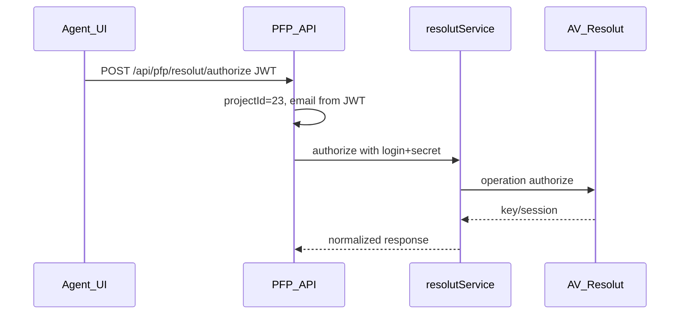

Копия плана для открытия из воркспейса (оригинал Cursor может лежеть в `%USERPROFILE%\.cursor\plans\` с кириллицей в имени).

# План интеграции AV Информ / Резолют (project 23)

## Статус «всё норм?»

Демо **authorize / products / quote** для `assetShort` с актуальным паролем работают; бэкенд уже проксирует этап 1 через [`src/services/resolutService.js`](../../src/services/resolutService.js) и [`src/routes/resolutRoutes.js`](../../src/routes/resolutRoutes.js) при `RESOLUT_PROJECT_ID=23`. Ниже — доводка продукта под ваши 4 пункта.

---

## 1. Авторизация: «те же логины/пароли», агент из project 23

**Как сейчас:** логин/пароль/`static_key` берутся из настроек проекта (`resolut_agent_login`, `resolut_agent_password`, `resolut_static_key`) или env — см. [`getCredentials`](../../src/services/resolutService.js). **Не** из записи агента в JWT.

**Ваш выбор — автопривязка к агенту:** логин разумно брать из **`req.user.email`** (или аналог из `pfpMiddleware`). **Но:** в БД у пользователя только **`password_hash`** ([`agentService.js`](../../src/services/agentService.js)), восстановить исходный пароль для вызова Резолюта **невозможно**.

**Рекомендуемая реализация (совместима с «тот же пароль», что в ЛК):**

- **Логин:** всегда `req.user.email` для проекта 23 (если партнёр завёл того же пользователя в Резолюте).
- **Пароль Резолюта:** один из путей (выбрать один на MVP):
  - **A (практично):** при первом заходе в сценарий «Резолют» агент один раз вводит пароль; сохраняем **зашифрованно** в настройках **на агента** (новый ключ в `settingsService`, например `resolut_password_encrypted` + `projectId`/agent scope) — по смыслу тот же пароль, что и от ЛК, но не из хэша.
  - **B:** оставить пароль только в проектных настройках (как сейчас), но **логин** подставлять с агента — полуавто.
  - **C (идеал на потом):** SSO / обмен токеном от партнёра — отдельный эпик.

**Задачи:** расширить `resolutService`/контроллер: для `projectId === RESOLUT_PROJECT_ID` резолвить логин с пользователя; пароль — по выбранной схеме A/B; не ломать остальные проекты. Задокументировать угрозы (хранение секрета, ротация).

---

## 2. Расчёт НСЖ `assetShort` для цели LIFE (goal_type_id 5)

**Как сейчас:** LIFE идёт в [`fetchLifeNsjResult`](../../src/algorithms/calculators/lifeUpfrontAmount.js) → [`nsjApiService.calculateLifeInsurance`](../../src/services/nsjApiService.js) → старый контур `api-life` / `Contract.LifeEndowment.calculate` (другой URL и контракт, чем Резолют PFP `quote`).

**Цель:** для **проекта 23** при расчёте LIFE вызывать **Резолют** `quote` с `code: "assetShort"` и тем же смыслом параметров (лимит, срок, пол, дата рождения, периодичность → `pType` из `payment_variant`).

**Задачи:**

- Ввести адаптер (например `resolutNsjQuoteAdapter` или ветка в `nsjApiService`): из `(target_amount, term_months, client, payment_variant)` собрать `parameters` в формате успешного демо-запроса (плоский `currency` / `pType`, как уже проверено).
- Вызов: внутренний вызов `resolutService.quote(projectId, body)` **без HTTP к самим себе** (тот же процесс), с учётом Bearer/static key из настроек.
- Нормализовать ответ Резолюта (`premium`, `limit`, `risks`, …) в **ту же форму**, что ожидает [`LifeInsuranceCalculator`](../../src/algorithms/calculators/LifeInsuranceCalculator.js) (поля вроде `total_premium`, `total_limit`, `risks`, `term_years`).
- Ограничить ветку **`projectId === 23`** (или `=== RESOLUT_PROJECT_ID`), остальные проекты — прежний `api-life`.
- Тесты: юнит на маппинг; при наличии кредов — интеграционный скрипт (у вас уже есть [`scripts/test_resolut_quote.js`](../../scripts/test_resolut_quote.js)).

---

## 3. PDF отчёт: шаблоны из каталога Finam для проекта AV (без изменений «проекта Финам»)

**Разделение сущностей:** **проект 14 (Финам)** и **проект 23 (AV Информ)** — это **два разных проекта** в продукте. Цель — **ни данных, ни специфичной логики Финама для 14 не трогать**: не менять сценарии ЛК Финама, не подмешивать 23 в их настройки. Нужно лишь, чтобы у **23** при генерации PDF вызывался **тот же набор HTML-макетов**, что уже лежит в [`src/reports/finam/`](../../src/reports/finam/) (общий код верстки, не «владелец» Финама).

**Как сейчас:** эта вёрстка включается только если `Number(projectId) === FINAM_PROJECT_ID` (**14**), см. [`reportPdfService.js`](../../src/services/reportPdfService.js) (`isFinamProject`) и [`FINAM_PROJECT_ID` в `buildFinamReportHtml.js`](../../src/reports/finam/buildFinamReportHtml.js). Проект **23** сейчас в **default** теме.

**Задачи (без изменения темы Ростех 22):**

- Вынести список `projectId`, для которых включается **пайплайн Finam-шаблонов**: например `FINAM_TEMPLATE_PROJECT_IDS = [14, 23]` или env `FINAM_REPORT_PROJECT_IDS=14,23` — семантика: «использовать эти HTML-шаблоны», а не «редактировать проект Финам».
- Заменить жёсткое сравнение `projectId === 14` на **membership** этого списка везде, где считается `isFinamProject` ([`reportPdfService.js`](../../src/services/reportPdfService.js), [`reportPagesController.js`](../../src/controllers/reportPagesController.js) и при необходимости [`pdfSettingsService.js`](../../src/services/pdfSettingsService.js)).
- Проверить превью/настройки PDF в ЛК для **23** ([`.cursor/skills/pdf-report-backend/SKILL.md`](../../.cursor/skills/pdf-report-backend/SKILL.md)).
- **Граница:** правки в общих модулях (`buildFinamReportHtml`, appliers) — только если без этого 23 не соберёт отчёт; при любом сомнении выносить отличия в ветку по `projectId === 23`, чтобы **поведение отчёта для 14 осталось прежним**. Comon/инвест-контур Финама не затрагивать.

---

## 4. Документация для Cursor: [`.cursor/agents/avinform-resolut.md`](../../.cursor/agents/avinform-resolut.md)

**Обновить агентский файл:**

- Зафиксировать **project 23** как целевой для Resolut; ссылка на `RESOLUT_PROJECT_ID`.
- Описать **две цепочки НСЖ:** legacy `api-life` vs Резолют `quote` / `assetShort` для 23.
- Пункт про **PDF:** проект 23 подключает **те же файлы шаблонов** из `src/reports/finam`, что и 14; **проект 14 как тенант Финама не меняется** — только расширяется список `projectId` для этого пайплайна. Ростех 22 — табу.
- Ссылка на партнёрские доки: [`docs/partners/RESOLUT_HYBRID_IMPLEMENTATION_NOTES.md`](../partners/RESOLUT_HYBRID_IMPLEMENTATION_NOTES.md), [`report-first-integration.md`](../partners/report-first-integration.md) (обновить итог: quote OK для assetShort).
- Напоминание: секреты только env/настройки; пароль не читается из `password_hash`.

По желанию синхронно коротко обновить [`docs/partners/RESOLUT_HYBRID_IMPLEMENTATION_NOTES.md`](../partners/RESOLUT_HYBRID_IMPLEMENTATION_NOTES.md) (auth-модель, LIFE→assetShort, PDF).

---

## Порядок внедрения (рекомендация)

1. PDF: расширить список Finam-project IDs (**быстрый видимый эффект** для ЛК 23).
2. LIFE → Resolut `assetShort` в расчёте (ядро продукта).
3. Авторизация: логин с JWT + хранение пароля Резолюта по схеме A или B.
4. Документация агента + партнёрские заметки.

---

## Риски

- **Пароль:** без отдельного ввода/хранения секрета «авто из БД» не выполнить — в плане заложена честная схема.
- **Два НСЖ-API:** расхождение контрактов; держать ветвление строго по `projectId`.
- **Нагрузка/таймауты:** у `nsjApiService` таймаут 3s; у Резолюта в [`resolutService`](../../src/services/resolutService.js) 10s — при объединении выровнять ожидания для LIFE на 23.
